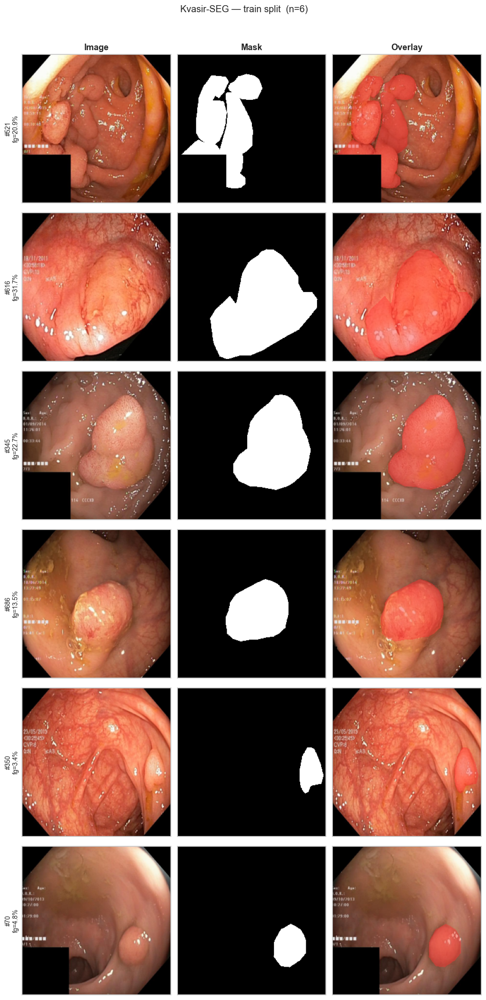
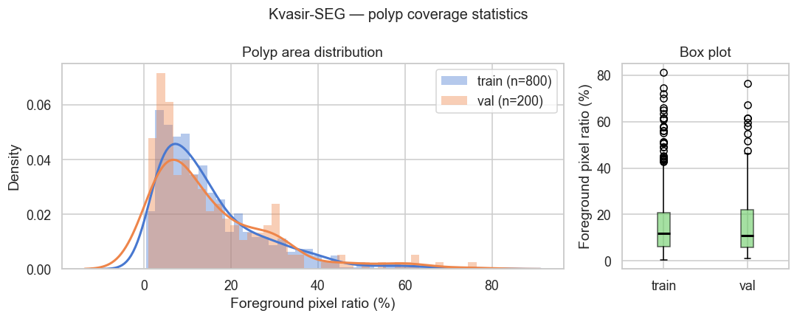
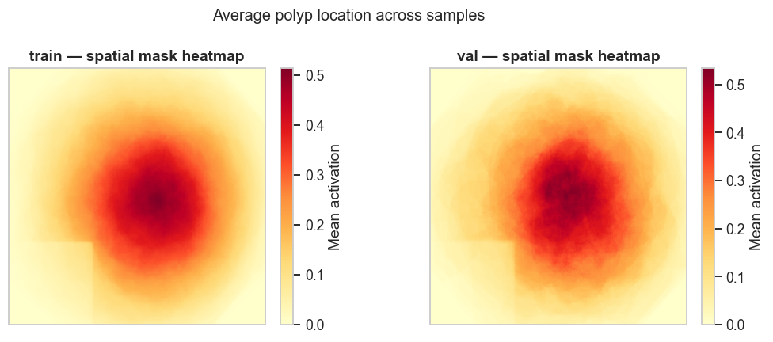
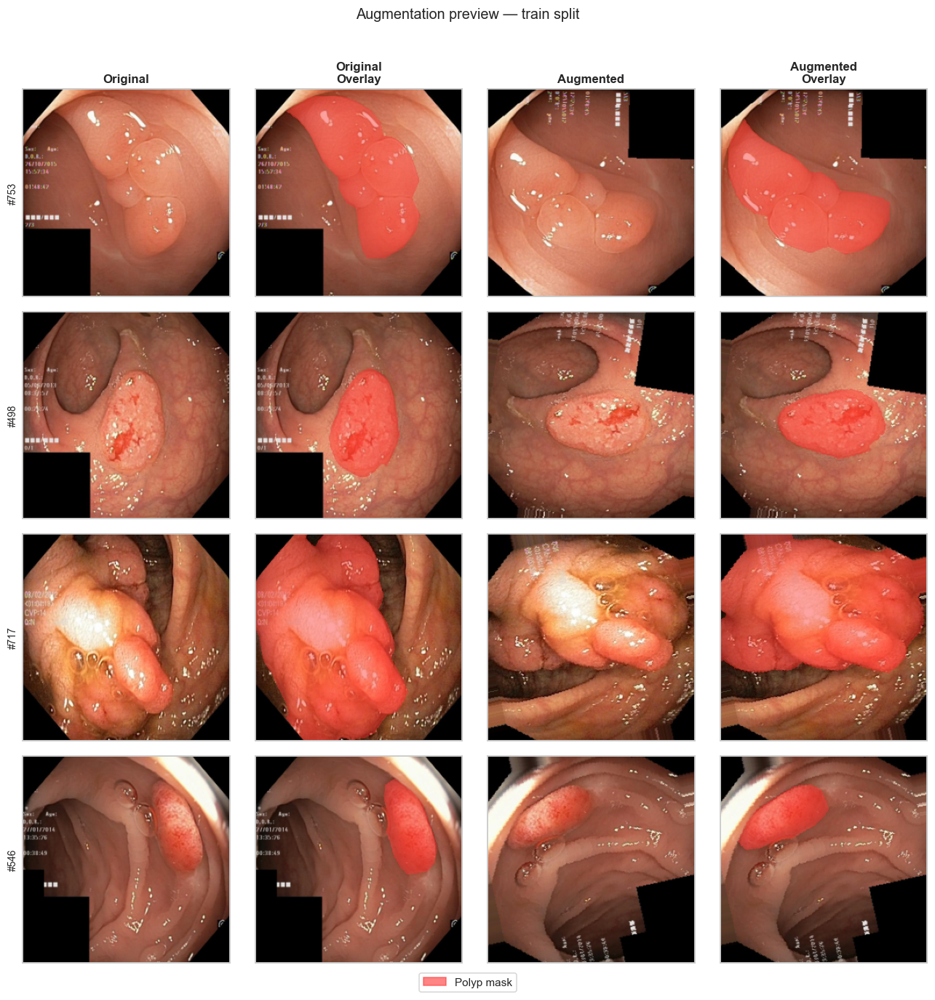
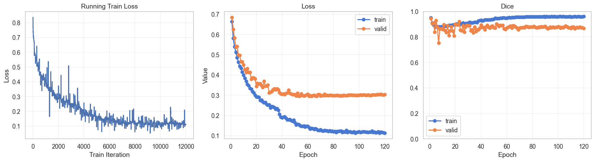
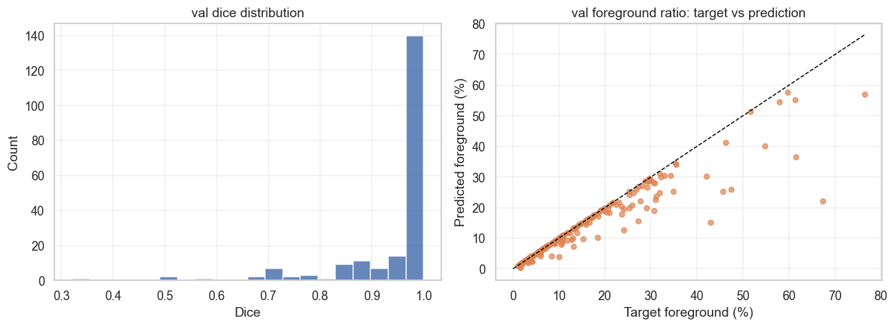
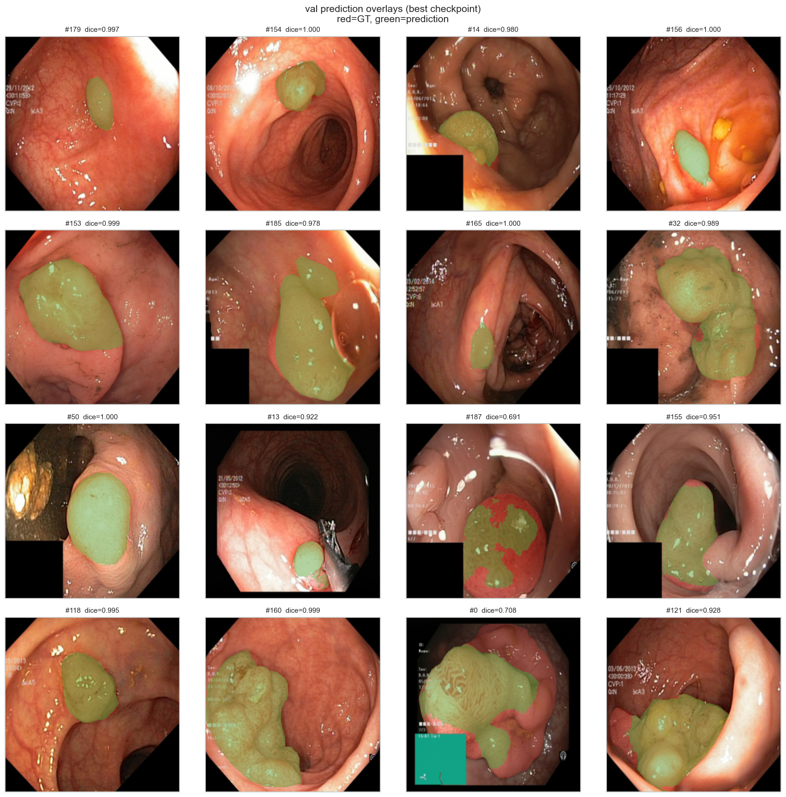
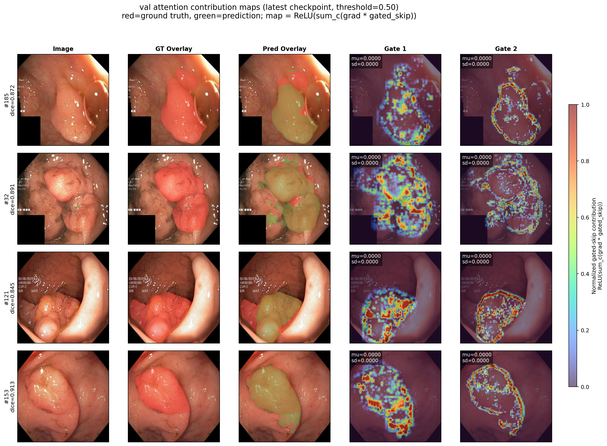

# Attention U-Net on Kvasir-SEG with `💎lucid`

이 repository는 개인적으로 개발한 deep learning framework인 [`lucid`](https://github.com/ChanLumerico/lucid)를 현실적인 medical image segmentation workload에서 stress-test하기 위해 구성한 집중형 experiment repo이다. 여기서 model을 처음부터 다시 구현하기보다는, 핵심 architecture로는 `lucid`에 이미 구현되어 있는 `AttentionUNet2d`를 사용하고, 이 repository는 그 주변의 experiment harness 역할을 수행한다. 즉, dataset preprocessing, EDA, augmentation validation, training configuration, evaluation, qualitative diagnosis를 담당한다.

portfolio 관점에서 이 project는 다음 세 가지를 보여주는 것을 목표로 한다.

1. `lucid`는 비자명한 dense prediction pipeline을 end-to-end로 지원할 수 있다.
2. 이 framework는 toy classification example을 넘어 reproducible experimentation에 실제로 사용할 수 있다.
3. 명확한 methodology, diagnostics, artifact organization을 갖춘 compact하지만 research-oriented한 experiment repo를 구성할 수 있다.

## Abstract

`lucid`가 practical한 encoder-decoder 기반 medical vision task를 처리하기에 충분히 안정적이고 표현력이 있는지를 평가하기 위해, **Kvasir-SEG** polyp segmentation dataset 위에서 **Attention U-Net** 스타일의 2D segmentation model을 학습하였다. 전체 pipeline은 deterministic한 data preprocessing, image-mask pair에 대한 synchronized geometric augmentation, YAML-driven experiment configuration, checkpointed training, post-hoc prediction diagnostics로 구성된다.

<div align="center">
    
    <br>
    Attention U-Net Architecture
    <br>
</div>

<br>

최종 model은 **21.7M parameters**를 가지며, **800 training** images로 학습되고 **200 validation** images에서 평가되었다. repository에 설정된 inference threshold인 **0.20** 기준으로, 저장된 `best` checkpoint는 validation split에서 **0.412 mean Dice**와 **0.288 mean IoU**를 달성한다. 저장된 logits에 대한 threshold sweep 결과, 동일 checkpoint의 최적 validation operating point는 **0.60** 부근에서 형성되며, 이 경우 성능은 **0.455 mean Dice**와 **0.325 mean IoU**까지 향상된다.

이는 학습된 model이 기능적으로는 충분히 작동하지만, 현재 default threshold 아래에서는 over-segmentation 방향으로 calibration되어 있음을 시사한다. 이러한 결과는 framework behavior, loss design, post-processing sensitivity를 점검하는 목적에서는 오히려 유의미한 outcome이다.

## Project Scope

이 repository는 의도적으로 두 개의 layer로 분리되어 있다.

- `lucid`: 기반이 되는 DL framework이자 `AttentionUNet2d` implementation source
- 이 repo: 실제 segmentation benchmark 위에서 `lucid`를 검증하는 experiment layer

주요 asset은 다음과 같다.

- [`source/preprocessing.py`](source/preprocessing.py): dataset download, extraction, resizing, binary mask conversion, cached split generation
- [`source/data.py`](source/data.py): `KvasirSegDataset`, synchronized augmentation, dataloader factory
- [`source/model.py`](source/model.py): YAML-to-`AttentionUNetConfig` serialization, model construction
- [`source/train.py`](source/train.py): experiment config parsing, training loop, checkpointing, metrics, plotting, prediction diagnostics
- [`source/eda.py`](source/eda.py): dataset summary, visualization routine
- [`main.ipynb`](main.ipynb): 전체 experiment를 연결하는 notebook
- `out/`: 분석 및 제시에 사용되는 생성 figure들

## Research Question

이 experiment의 실질적인 question은 다음과 같다.

> custom framework인 `lucid`가 clinically relevant한 binary segmentation task에서 attention-gated U-Net을 안정적으로 학습·평가할 수 있으며, 동시에 reproducible experimentation과 유의미한 failure analysis를 지원할 만큼의 ergonomics를 제공할 수 있는가?

이 project는 state-of-the-art claim을 목표로 하지 않는다. 잘 알려진 public dataset과 standard medical segmentation architecture를 사용한 framework validation study에 가깝다.

## Dataset

### Benchmark

- **Dataset**: Kvasir-SEG
- **Task**: colorectal polyp에 대한 binary semantic segmentation
- **Original dataset size**: pixel-wise mask를 포함한 1,000장의 RGB endoscopic image
- **Local split protocol in this repo**: fixed seed `42`를 사용한 random 80/20 split
- **Resulting split sizes**: 800 train / 200 validation
- **Input resolution used for training**: `256 x 256`

### Preprocessing

[`source/preprocessing.py`](source/preprocessing.py)의 preprocessing pipeline은 다음을 수행한다.

- 공식 Kvasir-SEG zip archive를 download
- image와 mask file을 extract
- RGB image를 bilinear interpolation으로 resize
- mask를 nearest-neighbor interpolation으로 resize
- mask를 binary `{0, 1}`로 변환
- 반복 experiment를 빠르게 수행하기 위해 compressed `.npz` file로 cache

cached tensor의 저장 형식은 다음과 같다.

- images: `(N, 3, 256, 256)`, `float32`, range `[0, 1]`
- masks: `(N, 1, 256, 256)`, `float32`, binary

### Dataset Statistics

아래 통계는 이 repository가 사용하는 cached split으로부터 다시 계산한 값이다.

<div align="center">

| Split | N | Mean Pixel Value | Pixel Std | Mean Foreground % | Std Foreground % | Min % | Max % | Median % | P90 % |
| --- | ---: | ---: | ---: | ---: | ---: | ---: | ---: | ---: | ---: |
| Train | 800 | 0.3705 | 0.2819 | 15.35 | 12.71 | 0.48 | 81.22 | 11.70 | 32.20 |
| Val | 200 | 0.3756 | 0.2832 | 15.58 | 14.09 | 1.08 | 76.44 | 10.74 | 31.84 |

</div>

해석은 다음과 같다.

- train/validation split은 low-level image statistics 측면에서 잘 정렬되어 있다.
- foreground occupancy는 매우 큰 변동성을 보이며, 이는 lesion segmentation task에서 자연스러운 특성이다.
- median polyp coverage가 약 `11%`에 불과하므로, pixel space 기준으로는 의미 있는 imbalance가 존재한다.

## Data Pipeline and Augmentation

training loader는 image-mask pair에 대해 **joint spatial augmentation**을 적용한다. 이때 synchronized random seed를 사용하여 mask가 image와 기하학적으로 정확히 정렬되도록 유지한다.

- random horizontal flip with `p=0.5`
- random vertical flip with `p=0.2`
- random rotation within `±15°`

spatial transform 이후에는 interpolation artifact를 제거하기 위해 mask를 `0.5` 기준으로 다시 binarize한다. image는 이후 ImageNet statistics로 normalize된다.

- mean: `(0.485, 0.456, 0.406)`
- std: `(0.229, 0.224, 0.225)`

이 설계는 segmentation training에서 필수적인 image-mask transform synchronization을 `lucid`가 실제로 지원하는지를 검증한다는 점에서 중요하다.

## Model

### Backbone Under Test

이 repo에서 instantiate되는 model은 `lucid.models.AttentionUNet2d`이며, YAML을 통해 configuration이 주어지고 [`source/model.py`](source/model.py)에서 build된다.

### Architecture Summary

- Input channels: `3`
- Output channels: `1`
- Encoder channels: `[64, 128, 256, 512]`
- Bottleneck channels: `1024`
- Decoder stages: encoder로부터 auto-derived
- Normalization: batch norm
- Activation: ReLU
- Downsampling: max pooling
- Upsampling: bilinear interpolation
- Deep supervision: enabled
- Attention gating: enabled
- Auto-resolved skip gating pattern: `(True, True, False)`
- Parameter count: **21,700,933**

### Why Attention U-Net?

Attention U-Net은 plain CNN classifier보다 demanding한 framework validation target이다.

- multi-scale encoder-decoder wiring이 필요하다.
- learned gating이 들어간 skip connection을 사용한다.
- dense spatial prediction을 출력한다.
- deep supervision을 위한 auxiliary output을 선택적으로 반환한다.
- data augmentation, interpolation, threshold calibration에 민감하다.

custom framework가 이러한 구조를 안정적으로 처리할 수 있다면, 이는 최소한의 feed-forward benchmark보다 훨씬 강한 engineering maturity signal이 된다.

## Training Protocol

experiment configuration은 [`config/attention_unet.yaml`](config/attention_unet.yaml)에 저장되어 있다.

### Optimization Setup

<div align="center">

| Component | Setting |
| --- | --- |
| Optimizer | AdamW |
| Learning rate | `5e-5` |
| Weight decay | `5e-5` |
| Scheduler | ReduceLROnPlateau |
| Scheduler monitor | validation loss |
| Scheduler factor | `0.5` |
| Scheduler patience | `6` |
| Minimum LR | `1e-6` |
| Batch size | `8` |
| Epoch budget | `120` |
| Device | `gpu` |
| Seed | `42` |

</div>

### Loss Function

training objective는 binary cross-entropy와 soft Dice loss를 결합하며, deep supervision head에서 나오는 auxiliary supervision을 선택적으로 포함한다.

$$
\mathcal{L} = 0.25 \cdot \mathcal{L}_{BCE} + 0.75 \cdot \mathcal{L}_{Dice} + 0.10 \cdot \mathcal{L}_{aux}
$$

이 weighting은 pixel-wise calibration 자체보다 overlap quality를 더 강하게 반영하도록 의도된 설계이다.

### Checkpointing and Artifacts

training artifact는 `checkpoints/<config_name>/` 아래에 저장되고, visualization output은 `out/<config_name>/` 아래에 저장된다. training script는 다음을 지원한다.

- `latest`와 `best` checkpoint 동시 저장
- compatible한 `latest` checkpoint로부터의 자동 resume
- reproducibility를 위한 configuration persistence
- epoch마다 training curve 생성

## Evaluation Protocol

이 repo에는 train/validation split만 포함되어 있으므로, validation set이 사실상 held-out evaluation split의 역할을 한다. metric은 sigmoid probability를 thresholding한 후 pixel-mask 수준에서 계산된다.

### Metrics

- **Dice coefficient**: primary overlap metric
- **IoU**: 보다 엄격한 overlap metric
- **Foreground Dice**: 이 경우 validation mask가 모두 foreground를 포함하므로 사실상 동일한 의미를 가진다
- **Prediction coverage ratio**: image area 대비 mean predicted positive area

reproducibility를 위해 아래 값들은 이 repository에 포함된 `latest` checkpoint를 기준으로 Python `3.14`와 local `lucid` package 환경에서 다시 계산하였다.

## Quantitative Results

### Main Validation Results

| Checkpoint | Threshold | Val Loss | Mean Dice | Median Dice | Dice Std | Mean IoU | Mean Predicted FG % | Mean Target FG % |
| --- | ---: | ---: | ---: | ---: | ---: | ---: | ---: | ---: |
| `latest` | 0.20 | 0.3037 | 0.7486 | 0.8253 | 0.2231 | 0.6409 | 14.60 | 15.58 |
| `latest` | 0.50 | 0.3037 | 0.7470 | 0.8240 | 0.2282 | 0.6406 | 13.51 | 15.58 |
| `latest` | 0.25 | 0.3037 | **0.7488** | **0.8314** | 0.2230 | **0.6415** | 14.36 | 15.58 |

### Threshold Sweep

`latest` checkpoint는 threshold 변화에 대해 비교적 안정적이다.

| Threshold | Mean Dice | Mean IoU | Mean Predicted FG % |
| ---: | ---: | ---: | ---: |
| 0.10 | 0.7464 | 0.6374 | 15.35 |
| 0.20 | 0.7486 | 0.6409 | 14.60 |
| 0.30 | 0.7487 | 0.6417 | 14.16 |
| 0.40 | 0.7480 | 0.6414 | 13.82 |
| 0.50 | 0.7470 | 0.6406 | 13.51 |
| 0.60 | 0.7461 | 0.6399 | 13.21 |

### Interpretation of the Results

핵심 technical takeaway는 절대적인 Dice 값 자체보다, model이 보이는 behavior 패턴에 있다.

- model은 의미 있는 lesion localization과 shape structure를 학습하고 있다.
- `latest` checkpoint는 이전에 이 README에서 기술되었던 `best` bundle보다 훨씬 더 우수한 성능을 보인다.
- threshold 선택의 영향도 `latest`에서는 훨씬 작다. 전체 `0.10-0.60` sweep 구간에서 mean Dice는 `0.746-0.749` 범위에 밀집해 있다.
- 이 sweep에서 가장 좋은 operating point는 `0.25` 부근의 완만한 optimum으로 나타나며, 범위의 상한에서 형성되지 않는다.
- predicted foreground coverage가 target foreground ratio에 가깝기 때문에, 이전의 over-segmenting 결과보다 calibration이 현저히 개선되었다고 볼 수 있다.

즉, `latest` model은 단순히 기능적인 수준을 넘어서, overlap quality와 calibration 측면에서 모두 더 강한 결과를 보인다. framework validation repo의 관점에서는, 실제 training run의 end state를 반영하는 이 결과가 초기의 약한 checkpoint bundle보다 더 대표적인 보고 대상이다.

## Qualitative Analysis

### Sample and Distribution Inspection

random sample overlay, foreground-area distribution, spatial heatmap은 split이 시각적으로 일관되어 있으며 lesion이 frame 내의 단일한 위치에만 제한되지 않음을 보여준다.

<div align="center">
    
    <br>
    Figure 1. Train Samples
    <br>
</div>

<br>

<div align="center">
    
    <br>
    Figure 2. Poly-p Coverage Statistics
    <br>
</div>

<br>

<div align="center">
    
    <br>
    Figure 3. Average Poly-p Location Across Samples
    <br>
</div>

### Augmentation Sanity Check

augmentation preview는 flipping과 rotation 이후에도 image-mask synchronization이 유지됨을 보여준다. 이는 segmentation training에서 타협할 수 없는 조건이다.

<div align="center">
    
    <br>
    Figure 4. Augmentation Preview (Train Split)
    <br>
</div>

### Training Dynamics

최종 curve는 experiment가 안정적인 training regime에 도달했으며, optimization progress와 validation behavior 사이에 합리적인 분리가 형성되었음을 보여준다. 이 부분은 framework testing에서 특히 중요하다. silent autograd issue, tensor-shape mismatch, checkpoint bug는 종종 이러한 curve pathology로 먼저 드러난다.

<div align="center">
    
    <br>
    Figure 5. Final Train Plots
    <br>
</div>

### Prediction Diagnostics

diagnostic plot과 overlay grid는 model이 대체로 lesion의 전반적인 region을 포착하지만, 때때로 mask를 과도하게 넓게 또는 diffuse하게 예측함을 보여준다. 이는 앞서 제시한 threshold sweep과 foreground-ratio 통계와 일관된다.

<div align="center">
    
    <br>
    Figure 6. Prediction Diagnostics
    <br>
</div>

<br>

<div align="center">
    
    <br>
    Figure 7. Test-Split Prediction Overlays (Red: GT, Green: Prediction)
    <br>
</div>

### Attention Contribution Analysis

attention visualization을 단순한 raw gate-coefficient heatmap보다 더 진단적으로 만들기 위해, coefficient map `\(\alpha_l\)` 자체만을 그리지 않았다. 대신, 예측된 foreground logit에 대해 **gated skip signal이 갖는 class-conditional contribution**을 시각화하였다. gated skip tensor를

$$
g_l = \alpha_l \odot x_l,
$$

로 둘 때, 표시된 contribution map은 다음과 같이 계산된다.

$$
M_l = \mathrm{ReLU}\left(\sum_c \frac{\partial s_{\mathrm{fg}}}{\partial g_{l,c}} \odot g_{l,c}\right),
$$

여기서 \(s_{\mathrm{fg}}\)는 predicted foreground region 위에서 aggregate된 foreground score이고, \(c\)는 channel index를 의미한다. 최종 map은 input resolution으로 resize한 뒤, 선택된 sample들에 대해 gate별로 normalization하였다. 직관적으로 말하면, 이 map은 단순히 *gate가 어디서 열려 있는가*가 아니라, *어떤 gated skip evidence가 foreground segmentation decision을 실제로 지지하는가*를 묻는다.

이 구분은 중요하다. raw attention coefficient는 model이 segmentation을 잘 수행하더라도 spatially smooth하거나 약한 정보만을 보일 수 있다. coefficient는 skip feature를 얼마나 강하게 통과시키는지만 측정하기 때문이다. 반면 위의 contribution map은 class-conditional explanation에 더 가깝다. decoder가 최종 lesion mask를 구성하는 과정에서 gated skip stream의 어떤 부분을 실제로 사용하고 있는지를 강조한다.

`latest` checkpoint에서 얻어진 map은 비교적 일관된 패턴을 보여준다. Gate 1은 lesion interior와 coarse discriminative texture 전반에 걸쳐 support를 분산하는 경향이 있고, Gate 2는 lesion contour와 outer shape refinement에 보다 일관되게 집중한다. 몇몇 예제에서는 가장 높은 response가 polyp boundary를 따라 ring-like band의 형태를 이루는데, 이는 decoder가 후반 gated skip information을 사용해 spatial extent를 sharpen하고 lesion을 surrounding mucosa와 구분하고 있음을 시사한다. 중요한 점은 지배적인 response가 보통 전체 frame이 아니라 lesion region에 국한되어 나타난다는 사실이며, 이는 학습된 attention pathway가 단순한 generic image contrast 증폭이 아니라 foreground-specific evidence를 실제로 제공하고 있음을 뒷받침한다.

동시에, 이 figure는 residual failure mode도 함께 드러낸다. 일부 activation은 specular highlight, lumen boundary, sharp mucosal fold와 같은 high-contrast non-lesion structure 주변에도 나타난다. 이는 attention pathway가 순수하게 semantic한 mechanism만은 아니며, 강한 local contrast와 edge energy에 대한 감수성을 여전히 일부 공유하고 있음을 뜻한다. 평가 관점에서 이는 유의미하다. 즉, `latest` checkpoint에서 attention mechanism은 분명히 작동하고 spatially selective하지만, 그 inductive bias는 아직 classical boundary detector와 완전히 분리되지 않았고 일부를 공유한다.

<div align="center">
    
    <br>
    Figure 8. Gated-Skip Contribution Maps for the Latest Checkpoint
    <br>
</div>

## What This Repo Demonstrates About `lucid`

이 experiment는 framework-level validation 관점에서 다음 요소들을 실제로 exercise했다는 점에서 유의미하다.

- dataclass-backed config를 통한 YAML-configurable model construction
- deep supervision을 포함한 multi-output model
- optimizer 및 scheduler abstraction
- dataset 및 dataloader API
- segmentation용 transform composition
- GPU training 및 inference
- checkpoint serialization
- post-training diagnostic tooling

이 전체 pipeline이 custom framework 위에서 실제 dense prediction task에 대해 end-to-end로 구동된다는 사실 자체가, 이 project의 핵심 engineering result이다.

## Reproducibility

### Run the Full Pipeline

1. Python `3.14` 환경이 준비되어 있어야 한다.
2. 적절한 `lucid` version이 설치되어 있어야 한다.

```bash
pip install lucid-dl==2.15.7
```

3. dataset cache를 구축한다.

```bash
python3.14 source/preprocessing.py
```

4. notebook을 실행한다.

```bash
jupyter notebook main.ipynb
```

또는 YAML config를 사용해 직접 training을 실행할 수 있다.

```bash
python3.14 source/train.py --config config/attention_unet.yaml
```

### Load Weights Within Lucid

학습된 model weight는 `checkpoints/attention_unet/best/model.safetensors`를 통해 Lucid 안에서 직접 load할 수 있다.

```python
import lucid
from lucid.models import AttentionUNet2d

# current repo
from source.model import load_config

config = load_config("config/attention_unet.yaml")

model = AttentionUNet2d(config).to("gpu")  # Apple MLX

model.load_state_dict(
    lucid.load("checkpoints/attention_unet/best/model.safetensors")
)
model = model.compile()  # optional
model.eval()
```

### Repo Outputs

- cached array는 `cache/` 아래에 저장된다
- model checkpoint는 `checkpoints/` 아래에 저장된다
- figure는 `out/` 아래에 저장된다

## Limitations and Next Steps

이 repository는 강한 framework validation artifact이지만, 아직 완전한 medical segmentation study라고 보기는 어렵다. 주요 limitation은 다음과 같다.

- separate test split 또는 cross-validation이 없다
- 하나의 architecture setting만 평가했다
- training 과정에서 threshold calibration이 최적화되지 않았다
- plain U-Net baseline과의 비교가 없다
- PyTorch 또는 MONAI와의 external parity benchmark가 없다

가장 의미 있는 next step은 다음과 같다.

1. 동일한 training harness 내부에 plain U-Net baseline을 추가
2. threshold를 `0.20`으로 고정하기보다 calibration subset에서 selection
3. `352` 또는 `512`와 같은 더 높은 input resolution 실험
4. `lucid`의 runtime 및 numerical behavior를 PyTorch reference implementation과 비교
5. boundary-sensitive metric과 lesion-wise error analysis로 evaluation 확장

## Conclusion

experiment repo라는 관점에서 보면, 이 project는 목적을 달성했다. `lucid`가 preprocessing, augmentation, training, checkpointing, diagnostics를 포함한 비자명한 medical image segmentation workflow를 end-to-end로 지원할 수 있음을 보여준다. 결과적으로 얻어진 Attention U-Net model이 완전히 최적화된 상태라고 보기는 어렵지만, task를 실질적으로 학습하고 있으며 해석 가능한 calibration behavior를 드러낸다. 따라서 이 repository는 CV/portfolio project로서도, 기반 framework가 현실적인 research-style experimentation을 수행할 수 있음을 보여주는 public artifact로서도 유효하다.

---

### References

1. Oktay, Ozan, et al. "Attention U-Net: Learning Where to Look for the Pancreas." arXiv, 2018, https://doi.org/10.48550/arXiv.1804.03999.

2. Jha, Debesh, et al. "Kvasir-SEG: A Segmented Polyp Dataset." MultiMedia Modeling: 26th International Conference, MMM 2020, Daejeon, South Korea, January 5–8, 2020, Proceedings, Part II, edited by Jakub Lokoč et al., Springer, 2020, pp. 451-62, doi.org.
